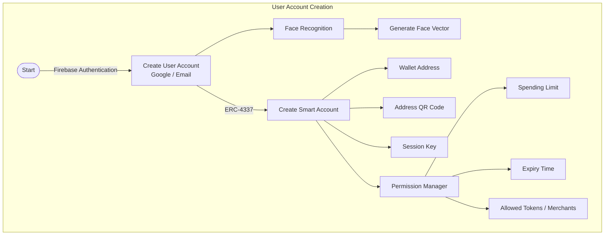
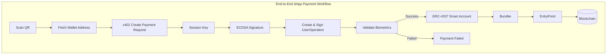

# AuthX

AuthX is an AI-powered autonomous payment platform that combines biometric authentication, ERC-4337 Smart Accounts, and the x402 payment protocol to enable secure, seamless crypto transactions on the modern web.

This repository contains the AuthX web frontend — a React + Vite single-page app with Firebase-backed authentication, an animated landing experience, in-app documentation, FAQ, and settings.

## Core Capabilities

- **Biometric authentication** — facial recognition verifies the payer before any transaction leaves the device.
- **ERC-4337 Smart Accounts** — programmable wallets enabling batched, sponsored, and policy-controlled transactions.
- **QR-addressable accounts** — every smart account surfaces its address as a scannable QR for instant off-chain handoff.
- **x402 payment protocol** — HTTP-native payments where the payer proves willingness with a signed intent instead of a full checkout flow.
- **ECDSA auto-signing** — post-biometric authorization, transactions are signed autonomously within a bounded policy.
- **Paymaster support** — gas fees can be sponsored so the end user never touches gas tokens.

## Tech Stack

- **React 19** + **Vite** (with `@vitejs/plugin-react`)
- **TypeScript** (mixed `.tsx` / `.jsx` components)
- **Firebase** — Auth (email/password) and Firestore
- **Framer Motion / Motion** — page transitions and UI animation
- **tsparticles** and **OGL** — particle and WebGL visual effects
- **Oxlint** — linting

## Getting Started

### Prerequisites

- Node.js 20+
- npm

### Setup

```bash
git clone https://github.com/argha-sarkar-2006/Auth-X.git
cd Auth-X
npm install
```

Create a `.env` file from the template and fill in your Firebase project credentials:

```bash
cp .env.example .env
```

```
VITE_FIREBASE_API_KEY=
VITE_FIREBASE_AUTH_DOMAIN=
VITE_FIREBASE_PROJECT_ID=
VITE_FIREBASE_STORAGE_BUCKET=
VITE_FIREBASE_MESSAGING_SENDER_ID=
VITE_FIREBASE_APP_ID=
```

### Run

```bash
npm run dev       # start dev server with HMR
npm run build     # production build (outputs to dist/)
npm run preview   # preview the production build
npm run lint      # run oxlint
```

## Project Structure

```
src/
├── App.jsx              # Root app: splash, auth gate, dock navigation
├── firebase.ts          # Firebase app / Auth / Firestore initialization
├── lib/utils.ts         # cn() class-merge helper
└── component/
    ├── loginpage.tsx    # Email/password login & signup (Firebase Auth)
    ├── Documentation.tsx# In-app AuthX documentation
    ├── FaqPage.tsx      # FAQ page
    ├── setting.jsx      # Settings page
    ├── Loadingpage.tsx  # Splash / loading screen
    ├── Dock.jsx         # macOS-style dock navigation
    └── ...              # Visual components (ElectricBorder, SplashCursor,
                         #   SideRays, GlassSurface, PixelCard, etc.)
```


## System Architecture

### User Registration & Smart Account Creation



### End-to-End dApp Payment Workflow



## App Flow

1. **Splash** — animated loading sequence on first load.
2. **Auth** — users sign in or sign up with email/password via Firebase; auth state persists across sessions.
3. **Home** — landing page with hero, particles, and QR handoff.
4. **Dock navigation** — slide between Home, Documentation, FAQ, and Settings.

## License

No license has been specified for this project yet.
